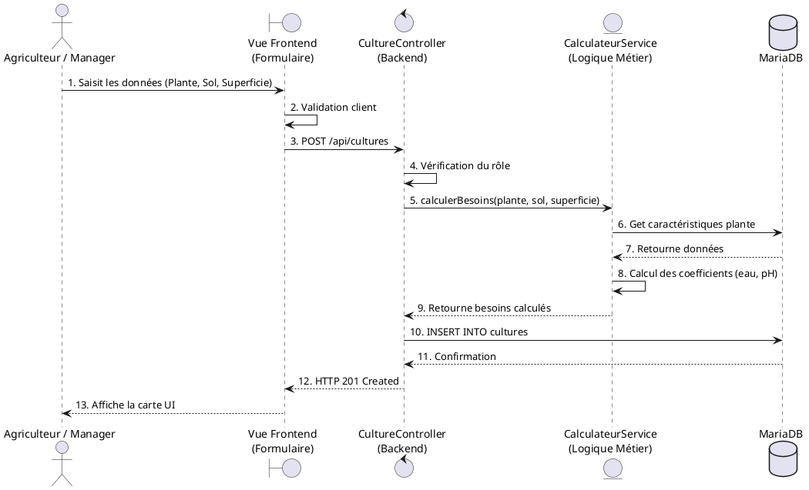

# Diagramme de séquence : Enregistrement d'une culture

Ce diagramme illustre le processus de création d'une culture avec le calcul automatique des besoins en eau et l'estimation du pH.

```plantuml
@startuml
actor "Agriculteur / Manager" as User
boundary "Vue Frontend\n(Formulaire)" as Frontend
control "CultureController\n(Backend)" as Controller
entity "CalculateurService\n(Logique Métier)" as Service
database "MariaDB" as DB

User -> Frontend : 1. Saisit les données (Plante, Sol, Superficie)
Frontend -> Frontend : 2. Validation client
Frontend -> Controller : 3. POST /api/cultures
Controller -> Controller : 4. Vérification du rôle
Controller -> Service : 5. calculerBesoins(plante, sol, superficie)
Service -> DB : 6. Get caractéristiques plante
DB --> Service : 7. Retourne données
Service -> Service : 8. Calcul des coefficients (eau, pH)
Service --> Controller : 9. Retourne besoins calculés
Controller -> DB : 10. INSERT INTO cultures
DB --> Controller : 11. Confirmation
Controller --> Frontend : 12. HTTP 201 Created
Frontend --> User : 13. Affiche la carte UI
@enduml
```
