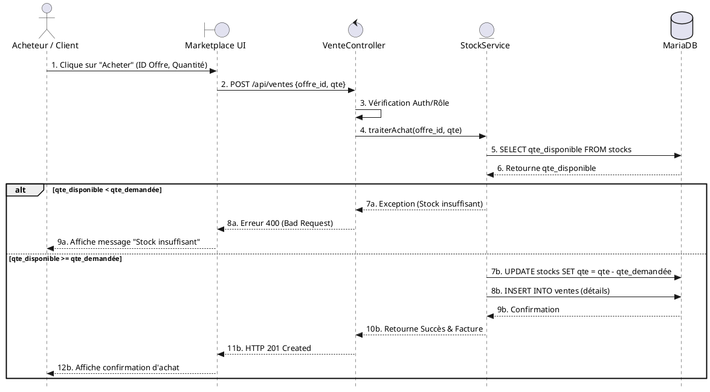

# Diagramme de séquence : Achat Marketplace & Gestion des Stocks

Ce diagramme illustre le processus d'achat d'une culture sur le Marketplace, en incluant la vérification critique de la disponibilité en stock (bloc "alt").

